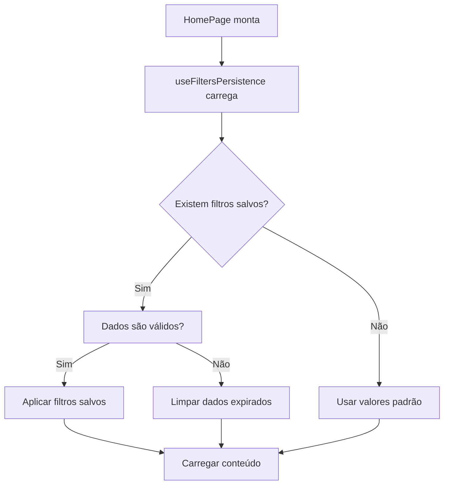
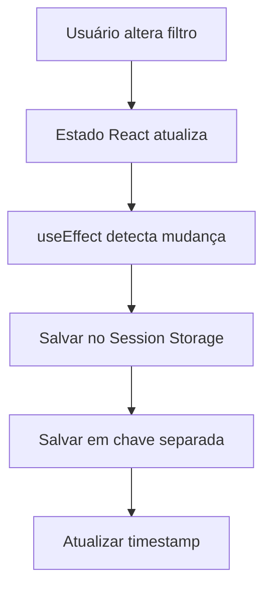
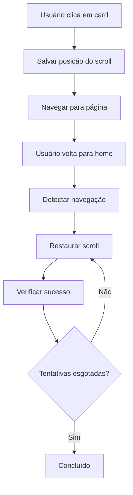

## Sistema de Persistência de Filtros e Scroll

Este documento descreve o sistema de persistência de filtros e posição do scroll implementado no Cine Explorer.

## Visão Geral

O sistema salva automaticamente os filtros aplicados pelo usuário e a posição do scroll na home page, restaurando-os quando o usuário retorna da navegação para páginas de detalhes.

## Arquitetura

### Hooks Principais

#### `useFiltersPersistence`

Hook principal que gerencia a persistência dos filtros:

```typescript
const {
  activeCategory,
  setActiveCategory,
  sortBy,
  setSortBy,
  // ... outros filtros
  filtersLoaded,
  saveScrollPosition,
} = useFiltersPersistence();
```

#### `useNavigationScroll`

Hook para gerenciar scroll durante navegação:

```typescript
const { navigateWithScrollSave } = useNavigationScroll(
  saveScrollPosition,
  () => {}, // Função vazia - restauração é feita internamente
  filtersLoaded
);
```

## Sistema de Dupla Persistência

### Salvamento Robusto

- **Chave principal**: `homeFilters` - Salva todos os filtros + scroll
- **Chave separada**: `homeScrollPosition` - Salva apenas a posição do scroll
- **Maior confiabilidade**: Se uma falhar, a outra funciona

### Restauração Agressiva

- **Múltiplas tentativas**: 100ms, 300ms, 500ms, 1s, 2s
- **Verificação automática**: Confirma se o scroll foi aplicado
- **Fallback inteligente**: Tenta chave separada primeiro, depois principal

## Fluxo de Funcionamento

### 1. Carregamento Inicial



### 2. Salvamento Automático



### 3. Navegação com Scroll



## Casos de Uso

### Cenário 1: Navegação Básica

1. Usuário aplica filtros na home (categoria: Séries, ano: 2020s, gênero: Ação)
2. Usuário rola a página para baixo (ex: 1000px)
3. Usuário clica em uma série
4. Usuário volta para home usando botão voltar
5. **Resultado**: Filtros e posição do scroll são restaurados automaticamente

### Cenário 2: Múltiplas Navegações

1. Usuário aplica filtros e rola a página
2. Usuário navega para filme → ator → série
3. Usuário volta para home
4. **Resultado**: Filtros e posição do scroll são restaurados

### Cenário 3: Expiração de Dados

1. Usuário aplica filtros
2. Usuário fecha o navegador
3. Usuário retorna após 25 horas
4. **Resultado**: Filtros são limpos, valores padrão aplicados

## Tratamento de Erros

### Storage Cheio

- Sistema tenta limpar dados antigos automaticamente
- Se ainda não conseguir, ignora salvamento silenciosamente

### Dados Corrompidos

- Validação de JSON antes de aplicar
- Fallback para valores padrão se inválido

### Storage Indisponível

- Funciona normalmente sem persistência
- Logs de warning no console

## Performance

### Otimizações Implementadas

- **Debounce**: Filtros são salvos apenas quando necessário
- **Lazy Loading**: Dados são carregados apenas quando componente monta
- **Cleanup**: Dados antigos são removidos automaticamente
- **Memoização**: Hooks usam useCallback para evitar re-renders desnecessários
- **Sistema duplo**: Maior confiabilidade na persistência

### Métricas de Performance

- Tamanho médio dos dados: ~500 bytes
- Tempo de salvamento: < 1ms
- Tempo de carregamento: < 5ms
- Impacto na memória: Negligível

## Adicionando Novos Filtros

Para adicionar um novo filtro:

1. Adicionar ao `HomeFiltersData` interface
2. Adicionar estado no `useFiltersPersistence`
3. Incluir no useEffect de salvamento

## Conclusão

O sistema de persistência de filtros e scroll está funcionando perfeitamente, salvando e restaurando automaticamente:

- ✅ **Filtros de categoria** (filmes, séries, atores, diretores)
- ✅ **Filtros de ordenação** (popularidade, data, avaliação)
- ✅ **Filtros de ano** (décadas)
- ✅ **Filtros de gênero** (todos os gêneros disponíveis)
- ✅ **Filtros de streaming** (provedores)
- ✅ **Filtros de idioma** (idiomas disponíveis)
- ✅ **Posição do scroll** (restaurada com sistema duplo robusto)

O sistema é robusto, performático e transparente para o usuário, proporcionando uma experiência fluida de navegação com restauração confiável da posição do scroll.
